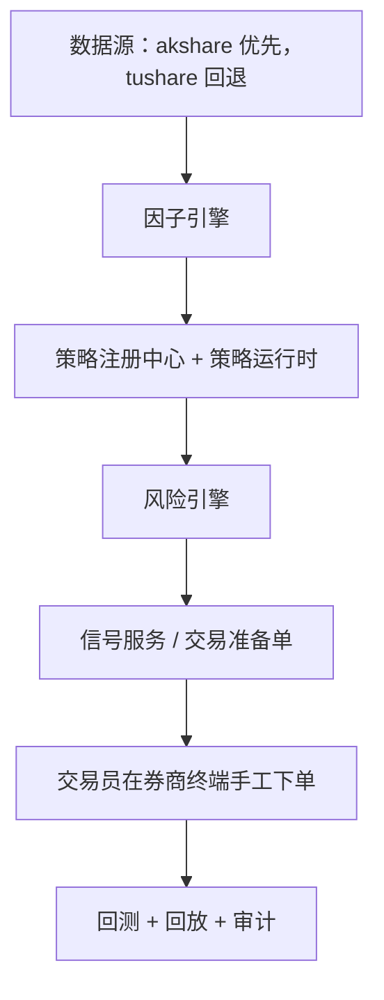

# 系统架构说明

## 1. 产品边界

- 系统定位为半自动辅助，不是全自动交易系统。
- 不接券商 API 自动执行。
- 不自动下单。
- 产出物包括：
  - 候选信号
  - 风险检查结果
  - 交易准备单
  - 回测与回放报告
  - 审计日志

## 2. 端到端流程

## 3. 模块拆分

### 3.1 数据层
- `data/base.py`：数据提供器抽象。
- `data/akshare_provider.py`：主数据提供器实现。
- `data/tushare_provider.py`：回退数据提供器实现。
- `data/composite_provider.py`：优先级路由 + 来源追踪。
- 新增财报快照读取能力：`get_fundamental_snapshot(symbol, as_of)`。
- `fundamentals/service.py`：财报快照标准化注入 + PIT 可用性 + 陈旧度标记。

### 3.2 因子层
- `factors/engine.py`
- 当前因子：
  - MA(5/20/60)
  - ATR14
  - 日收益
  - 动量(5/20/60)
  - 波动率20
  - zscore20
  - turnover20
  - 事件占位特征
  - 基本面特征：`roe`, `revenue_yoy`, `net_profit_yoy`, `gross_margin`, `debt_to_asset`, `ocf_to_profit`
  - 基本面子评分：`fundamental_profitability_score`, `fundamental_growth_score`, `fundamental_quality_score`, `fundamental_leverage_score`
  - 基本面总评分：`fundamental_score` + `fundamental_completeness`

### 3.3 策略层
- `strategy/base.py`：策略契约与上下文。
- `strategy/registry.py`：策略发现与获取。
- `strategy/*.py`：
  - `trend_following`
  - `mean_reversion`
  - `multi_factor`
  - `sector_rotation`
  - `event_driven`

### 3.4 风控层
- `risk/rules.py`：规则集合。
- `risk/engine.py`：信号级与组合级风险评估。
- 已实现检查：
  - T+1
  - ST 过滤
  - 停牌过滤
  - 涨跌停执行风险提示
  - 单标的仓位上限
  - 最低流动性门槛
  - 组合回撤阈值
  - 行业暴露约束
  - 财报质量门槛（warning/critical）与财报 PIT 违规阻断
  - 小资金可交易过滤（最小手数可买性、成本覆盖边际）

### 3.5 信号层
- `signal/service.py`
- 输出交易准备单，包括：
  - 动作建议
  - 风险摘要
  - 合规免责声明

### 3.6 回测层
- `backtest/engine.py`
- 核心内容：
  - 信号生成循环
  - 风险过滤
  - 滑点 + 手续费（最低佣金、印花税、过户费）
  - T+1 可卖数量模拟
  - 权益曲线与指标

### 3.7 审计层
- `audit/store.py`：基于 SQLite 的事件持久化。
- `audit/service.py`：日志写入/查询服务。
- 覆盖记录：
  - 行情数据调用
  - 信号运行
  - 风险检查
  - 组合风险检查
  - 回测运行
  - Pipeline 运行

### 3.8 批处理层
- `pipeline/runner.py`
- 面向标的列表批量运行：
  - 加载行情
  - 数据质量门控
  - 快照注册
  - 财报快照增强（可开关）
  - 运行策略
  - 执行风险检查
  - 汇总阻断/预警统计

### 3.9 治理层
- `governance/data_quality.py`：数据质量检查。
- `governance/snapshot_store.py`：PIT 快照元数据持久化。
- `governance/snapshot_service.py`：快照注册与查询服务。
- `governance/pit_validator.py`：防前视 PIT 校验。

### 3.10 组合构建层
- `portfolio/optimizer.py`：约束优先优化器。
- `portfolio/rebalancer.py`：目标权重到执行指令的调仓规划。
- `portfolio/stress.py`：情景压力测试。

### 3.11 回放层
- `replay/store.py`：信号与执行记录存储。
- `replay/service.py`：回放报告生成。

### 3.12 研究工作流层
- `workflow/research.py`：批量信号 + 风险过滤 + 可选组合优化。
- 候选收益由技术动量与基本面评分进行加权，降低纯技术噪声。

### 3.13 告警层
- `api/alerts.py`：基于审计事件派生告警流。
- `alerts/store.py`：订阅与通知持久化。
- `alerts/service.py`：审计同步、去重、ACK 流程。

### 3.14 策略治理层
- `strategy/governance_store.py`：策略版本状态持久化。
- `strategy/governance_service.py`：草稿/评审/决策/审批策略。

### 3.15 报告层
- `reporting/service.py`：signal/risk/replay 报告生成与导出。

### 3.16 模型风险层
- `monitoring/model_risk.py`：基于回测历史与执行跟随率做策略漂移检查。

### 3.17 数据许可证层
- `governance/license_store.py`：数据授权台账持久化。
- `governance/license_service.py`：使用范围 / 导出 / 水印策略校验。
- `api/data_license.py`：许可证注册/查询/校验 API。
- 运行时接入点：`market`, `signals`, `backtest`, `pipeline`, `research`, `reports`, `audit/export`。

### 3.18 运维作业层
- `ops/job_store.py`：作业定义与运行历史持久化。
- `ops/job_service.py`：触发执行 + cron 调度 tick + SLA 评估。
- `api/jobs.py`：注册/查询/运行 + 调度 tick/SLA API。

### 3.19 调度与运维看板层
- `ops/cron.py`：cron 解析和匹配（`*`、list、range、step）。
- `ops/scheduler_worker.py`：可选后台 worker，周期调度与 SLA 审计。
- `ops/dashboard.py`：运维聚合指标（作业健康 + 告警积压 + 执行偏差 + 事件治理统计）。
- `api/metrics.py`：`/metrics/ops-dashboard` 指标接口。

### 3.20 事件治理 / 连接器 / PIT 联接层
- `governance/event_store.py`：事件源台账与事件记录持久化。
- `governance/event_service.py`：批量入库、PIT 联接校验、事件因子增强。
- `governance/event_nlp.py`：事件标准化 + NLP 打分管线。
- `governance/announcement_connectors.py`：真实公告连接器适配器（`TUSHARE_ANNOUNCEMENT` / `FILE_ANNOUNCEMENT`）。
- `governance/event_connector_store.py`：连接器元数据、检查点、运行日志、失败队列。
- `governance/event_connector_service.py`：增量同步编排 + 失败重放 + SLA 升级状态机。
- `governance/event_connector_store.py`：SLA 告警状态表（去重/恢复/升级）和修复重放支持。
- `governance/event_nlp_store.py`：NLP 规则集/漂移快照持久化 + 反馈标注台账。
- `governance/event_nlp_governance.py`：规则集治理 + 漂移监控汇总 + 反馈质量检查。
- `governance/event_feature_compare.py`：事件特征回测对比报告服务。
- `api/events.py`：事件源/事件入库/连接器/重放/NLP/覆盖率/对比 API。
- 运行时接入点：`signals`, `backtest`, `pipeline`, `research`（事件增强）。

### 3.21 前端运维看板层
- `api/ops_ui.py`：`/ops/dashboard` HTML 入口。
- `web/ops-dashboard/index.html`：看板布局。
- `web/ops-dashboard/styles.css`：响应式主题与动画。
- `web/ops-dashboard/app.js`：实时拉取与渲染逻辑（SLA 状态机、NLP 漂移监控、回放工作台）。

### 3.22 部署层
- `deploy/docker/Dockerfile`：生产镜像构建。
- `deploy/docker-compose.single-node.yml`：单机部署（带持久化路径）。
- `deploy/k8s/private-cloud/trading-assistant.yaml`：私有云基础资源清单。
- `docs/deployment.md`：部署与加固手册。

## 4. API 接口面

- `/health`
- `/market/bars`
- `/market/calendar`
- `/data/quality/report`
- `/data/pit/validate`
- `/data/pit/validate-events`
- `/data/snapshots/register`
- `/data/snapshots`
- `/data/snapshots/latest`
- `/data/licenses/register`
- `/data/licenses`
- `/data/licenses/check`
- `/events/sources/register`
- `/events/sources`
- `/events/ingest`
- `/events`
- `/events/pit/join-validate`
- `/events/features/preview`
- `/events/connectors/register`
- `/events/connectors`
- `/events/connectors/overview`
- `/events/connectors/run`
- `/events/connectors/runs`
- `/events/connectors/failures`
- `/events/connectors/failures/repair`
- `/events/connectors/replay`
- `/events/connectors/replay/manual`
- `/events/connectors/replay/repair`
- `/events/connectors/sla`
- `/events/connectors/sla/sync-alerts`
- `/events/connectors/sla/states`
- `/events/connectors/sla/states/summary`
- `/events/ops/coverage`
- `/events/nlp/normalize/preview`
- `/events/nlp/normalize/ingest`
- `/events/nlp/rulesets`
- `/events/nlp/rulesets/activate`
- `/events/nlp/rulesets/active`
- `/events/nlp/drift-check`
- `/events/nlp/drift/snapshots`
- `/events/nlp/drift/monitor`
- `/events/nlp/feedback`
- `/events/nlp/feedback/summary`
- `/events/features/backtest-compare`
- `/factors/snapshot`
- `/strategies`
- `/strategy-governance/register`
- `/strategy-governance/submit-review`
- `/strategy-governance/approve`
- `/strategy-governance/decide`
- `/strategy-governance/versions`
- `/strategy-governance/latest-approved`
- `/strategy-governance/decisions`
- `/strategy-governance/policy`
- `/signals/generate`
- `/risk/check`
- `/portfolio/risk/check`
- `/portfolio/optimize`
- `/portfolio/rebalance/plan`
- `/portfolio/stress-test`
- `/backtest/run`
- `/pipeline/daily-run`
- `/replay/signals/record`
- `/replay/signals`
- `/replay/executions/record`
- `/replay/report`
- `/research/run`
- `/audit/events`
- `/audit/export`
- `/audit/verify-chain`
- `/alerts/recent`
- `/alerts/subscriptions`
- `/alerts/notifications`
- `/alerts/notifications/{notification_id}/ack`
- `/metrics/summary`
- `/metrics/ops-dashboard`
- `/model-risk/drift-check`
- `/reports/generate`
- `/compliance/preflight`
- `/ops/jobs/register`
- `/ops/jobs`
- `/ops/jobs/{job_id}/run`
- `/ops/jobs/{job_id}/runs`
- `/ops/jobs/runs/{run_id}`
- `/ops/jobs/scheduler/tick`
- `/ops/jobs/scheduler/sla`
- `/ops/dashboard`
- `/system/config`
- `/system/auth/me`
- `/system/auth/permissions`

## 5. 配置项

关键运行变量：
- `DATA_PROVIDER_PRIORITY`
- `TUSHARE_TOKEN`
- `MAX_SINGLE_POSITION`
- `MAX_DRAWDOWN`
- `MAX_INDUSTRY_EXPOSURE`
- `MIN_TURNOVER_20D`
- `AUDIT_DB_PATH`
- `SNAPSHOT_DB_PATH`
- `REPLAY_DB_PATH`
- `STRATEGY_GOV_DB_PATH`
- `LICENSE_DB_PATH`
- `JOB_DB_PATH`
- `ALERT_DB_PATH`
- `EVENT_DB_PATH`
- `OPS_SCHEDULER_ENABLED`
- `OPS_SCHEDULER_TICK_SECONDS`
- `OPS_SCHEDULER_TIMEZONE`
- `OPS_SCHEDULER_SLA_LOG_COOLDOWN_SECONDS`
- `OPS_SCHEDULER_SYNC_ALERTS_FROM_AUDIT`
- `OPS_JOB_SLA_GRACE_MINUTES`
- `OPS_JOB_RUNNING_TIMEOUT_MINUTES`
- `AUTH_ENABLED`
- `AUTH_HEADER_NAME`
- `AUTH_API_KEYS`
- `ENFORCE_APPROVED_STRATEGY`
- `ENFORCE_DATA_LICENSE`

## 6. 下一阶段交付目标

1. 多源连接器路由与故障切换策略（健康分 + 回退策略）
2. SLA 升级通道路由（邮件/IM/on-call 映射 + runbook 链接 + ACK 策略）
3. 合规证据包一键导出（审计链 + 策略/风控/事件治理产物）
