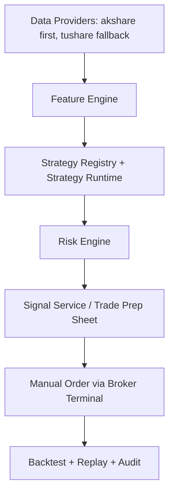

# System Architecture

## 1. Product Boundary

- Semi-automated assistant only.
- No broker API execution.
- No automatic order placement.
- Output artifacts:
  - candidate signals
  - risk checks
  - trade prep sheets
  - backtest and replay reports
  - audit logs

## 2. End-to-End Flow

## 3. Module Breakdown

### 3.1 Data
- `data/base.py`: provider abstraction.
- `data/akshare_provider.py`: primary provider implementation.
- `data/tushare_provider.py`: fallback provider implementation.
- `data/composite_provider.py`: prioritized fallback router + source tracing.

### 3.2 Factor Engine
- `factors/engine.py`
- Current features:
  - MA(5/20/60)
  - ATR14
  - daily return
  - momentum(5/20/60)
  - volatility20
  - zscore20
  - turnover20
  - event placeholders

### 3.3 Strategy Layer
- `strategy/base.py`: strategy contract + context.
- `strategy/registry.py`: strategy discovery and retrieval.
- `strategy/*.py`:
  - trend_following
  - mean_reversion
  - multi_factor
  - sector_rotation
  - event_driven

### 3.4 Risk Layer
- `risk/rules.py`: rule set.
- `risk/engine.py`: signal-level and portfolio-level risk evaluation.
- Implemented checks:
  - T+1
  - ST filter
  - suspension
  - limit-up/down execution risk
  - single-position cap
  - min liquidity
  - portfolio drawdown
  - industry exposure

### 3.5 Signal Layer
- `signal/service.py`
- Produces trade prep sheet with:
  - action guidance
  - risk summary
  - compliance disclaimer

### 3.6 Backtest Layer
- `backtest/engine.py`
- Includes:
  - signal generation loop
  - risk filtering
  - slippage + commission
  - T+1 availability simulation
  - equity curve and metrics

### 3.7 Audit Layer
- `audit/store.py`: SQLite event persistence.
- `audit/service.py`: logging/query facade.
- Captures:
  - market data calls
  - signal runs
  - risk checks
  - portfolio risk checks
  - backtests
  - pipeline runs

### 3.8 Pipeline Layer
- `pipeline/runner.py`
- Batch run for symbol lists:
  - load market bars
  - data quality gate
  - snapshot registration
  - run strategy
  - run risk checks
  - aggregate blocked/warning counts

### 3.9 Governance Layer
- `governance/data_quality.py`: dataset quality checks.
- `governance/snapshot_store.py`: PIT snapshot metadata persistence.
- `governance/snapshot_service.py`: snapshot query/registration service.
- `governance/pit_validator.py`: anti-lookahead PIT checks.

### 3.10 Portfolio Construction Layer
- `portfolio/optimizer.py`: constraint-first optimizer.
- `portfolio/rebalancer.py`: target-to-execution rebalance planning.
- `portfolio/stress.py`: scenario stress test.

### 3.11 Replay Layer
- `replay/store.py`: signal + execution storage.
- `replay/service.py`: replay report generation.

### 3.12 Research Workflow Layer
- `workflow/research.py`: batch signal generation + risk filtering + optional portfolio optimization.

### 3.13 Alert Layer
- `api/alerts.py`: derives alert feed from audited events.
- `alerts/store.py`: subscription + notification persistence.
- `alerts/service.py`: audit-event sync, dedupe, ACK workflow.

### 3.14 Strategy Governance Layer
- `strategy/governance_store.py`: strategy version state persistence.
- `strategy/governance_service.py`: draft/review/decision workflow and policy-based approval.

### 3.15 Reporting Layer
- `reporting/service.py`: signal/risk/replay markdown report generation and export.

### 3.16 Model Risk Layer
- `monitoring/model_risk.py`: strategy drift check using backtest history and replay follow rate.

### 3.17 Data License Layer
- `governance/license_store.py`: data authorization ledger persistence.
- `governance/license_service.py`: usage/export/watermark policy checks.
- `api/data_license.py`: license register/list/check endpoints.
- Runtime integration points: `market`, `signals`, `backtest`, `pipeline`, `research`, `reports`, `audit/export`.

### 3.18 Ops Job Layer
- `ops/job_store.py`: job definitions and run-history persistence.
- `ops/job_service.py`: trigger executor + cron schedule tick + SLA evaluation.
- `api/jobs.py`: register/list/run/query + scheduler tick/SLA APIs.

### 3.19 Ops Scheduler and Dashboard Layer
- `ops/cron.py`: cron expression parser and matcher (`*`, list, range, step).
- `ops/scheduler_worker.py`: optional background worker for periodic scheduler tick and SLA auditing.
- `ops/dashboard.py`: aggregate ops dashboard metrics (job health + alert backlog + execution variance + event governance stats).
- `api/metrics.py`: `/metrics/ops-dashboard` endpoint.

### 3.20 Event Governance, Connectors, and PIT Join Layer
- `governance/event_store.py`: event source ledger + event record persistence.
- `governance/event_service.py`: batch ingest, PIT join validation, and event-factor enrichment.
- `governance/event_nlp.py`: event normalization + NLP scoring pipeline.
- `governance/announcement_connectors.py`: real announcement connector adapters (`TUSHARE_ANNOUNCEMENT` / `FILE_ANNOUNCEMENT`).
- `governance/event_connector_store.py`: connector metadata, checkpoints, run log, failure queue.
- `governance/event_connector_service.py`: incremental sync orchestration + failure replay flow + SLA escalation state machine.
- `governance/event_connector_store.py`: persistent SLA alert state table (dedupe/recovery/escalation) and repair-replay support.
- `governance/event_nlp_store.py`: NLP ruleset/drift snapshot persistence + feedback label ledger.
- `governance/event_nlp_governance.py`: ruleset governance + drift monitor summary + feedback quality checks.
- `governance/event_feature_compare.py`: event feature backtest comparison report service.
- `api/events.py`: event source/event ingest/connectors/replay/nlp/coverage/compare APIs.
- Runtime integration points: `signals`, `backtest`, `pipeline`, `research` (event-driven auto-enrichment).

### 3.21 Frontend Ops Dashboard Layer
- `api/ops_ui.py`: `/ops/dashboard` HTML entrypoint.
- `web/ops-dashboard/index.html`: visual board layout.
- `web/ops-dashboard/styles.css`: responsive visual theme and animations.
- `web/ops-dashboard/app.js`: live data fetch and render logic (SLA state machine, NLP drift monitor, replay workbench).

### 3.22 Deployment Layer
- `deploy/docker/Dockerfile`: production image for API runtime.
- `deploy/docker-compose.single-node.yml`: single-node deployment with persistent data path.
- `deploy/k8s/private-cloud/trading-assistant.yaml`: namespace/config/secret/pvc/deployment/service baseline.
- `docs/deployment.md`: deployment and hardening runbook.

## 4. API Surface

- `/health`
- `/market/bars`
- `/market/calendar`
- `/data/quality/report`
- `/data/pit/validate`
- `/data/pit/validate-events`
- `/data/snapshots/register`
- `/data/snapshots`
- `/data/snapshots/latest`
- `/data/licenses/register`
- `/data/licenses`
- `/data/licenses/check`
- `/events/sources/register`
- `/events/sources`
- `/events/ingest`
- `/events`
- `/events/pit/join-validate`
- `/events/features/preview`
- `/events/connectors/register`
- `/events/connectors`
- `/events/connectors/overview`
- `/events/connectors/run`
- `/events/connectors/runs`
- `/events/connectors/failures`
- `/events/connectors/failures/repair`
- `/events/connectors/replay`
- `/events/connectors/replay/manual`
- `/events/connectors/replay/repair`
- `/events/connectors/sla`
- `/events/connectors/sla/sync-alerts`
- `/events/connectors/sla/states`
- `/events/connectors/sla/states/summary`
- `/events/ops/coverage`
- `/events/nlp/normalize/preview`
- `/events/nlp/normalize/ingest`
- `/events/nlp/rulesets`
- `/events/nlp/rulesets/activate`
- `/events/nlp/rulesets/active`
- `/events/nlp/drift-check`
- `/events/nlp/drift/snapshots`
- `/events/nlp/drift/monitor`
- `/events/nlp/feedback`
- `/events/nlp/feedback/summary`
- `/events/features/backtest-compare`
- `/factors/snapshot`
- `/strategies`
- `/strategy-governance/register`
- `/strategy-governance/submit-review`
- `/strategy-governance/approve`
- `/strategy-governance/decide`
- `/strategy-governance/versions`
- `/strategy-governance/latest-approved`
- `/strategy-governance/decisions`
- `/strategy-governance/policy`
- `/signals/generate`
- `/risk/check`
- `/portfolio/risk/check`
- `/portfolio/optimize`
- `/portfolio/rebalance/plan`
- `/portfolio/stress-test`
- `/backtest/run`
- `/pipeline/daily-run`
- `/replay/signals/record`
- `/replay/signals`
- `/replay/executions/record`
- `/replay/report`
- `/research/run`
- `/audit/events`
- `/audit/export`
- `/audit/verify-chain`
- `/alerts/recent`
- `/alerts/subscriptions`
- `/alerts/notifications`
- `/alerts/notifications/{notification_id}/ack`
- `/metrics/summary`
- `/metrics/ops-dashboard`
- `/model-risk/drift-check`
- `/reports/generate`
- `/compliance/preflight`
- `/ops/jobs/register`
- `/ops/jobs`
- `/ops/jobs/{job_id}/run`
- `/ops/jobs/{job_id}/runs`
- `/ops/jobs/runs/{run_id}`
- `/ops/jobs/scheduler/tick`
- `/ops/jobs/scheduler/sla`
- `/ops/dashboard`
- `/system/config`
- `/system/auth/me`
- `/system/auth/permissions`

## 5. Configuration

Key runtime variables:
- `DATA_PROVIDER_PRIORITY`
- `TUSHARE_TOKEN`
- `MAX_SINGLE_POSITION`
- `MAX_DRAWDOWN`
- `MAX_INDUSTRY_EXPOSURE`
- `MIN_TURNOVER_20D`
- `AUDIT_DB_PATH`
- `SNAPSHOT_DB_PATH`
- `REPLAY_DB_PATH`
- `STRATEGY_GOV_DB_PATH`
- `LICENSE_DB_PATH`
- `JOB_DB_PATH`
- `ALERT_DB_PATH`
- `EVENT_DB_PATH`
- `OPS_SCHEDULER_ENABLED`
- `OPS_SCHEDULER_TICK_SECONDS`
- `OPS_SCHEDULER_TIMEZONE`
- `OPS_SCHEDULER_SLA_LOG_COOLDOWN_SECONDS`
- `OPS_SCHEDULER_SYNC_ALERTS_FROM_AUDIT`
- `OPS_JOB_SLA_GRACE_MINUTES`
- `OPS_JOB_RUNNING_TIMEOUT_MINUTES`
- `AUTH_ENABLED`
- `AUTH_HEADER_NAME`
- `AUTH_API_KEYS`
- `ENFORCE_APPROVED_STRATEGY`
- `ENFORCE_DATA_LICENSE`

## 6. Next Delivery Targets

1. Multi-source connector routing and failover strategy (provider health scoring + fallback policy).
2. SLA escalation channel routing (email/IM/on-call mapping + runbook links + ack policy).
3. Compliance evidence bundle export (audit chain + strategy/risk/event governance artifacts).
